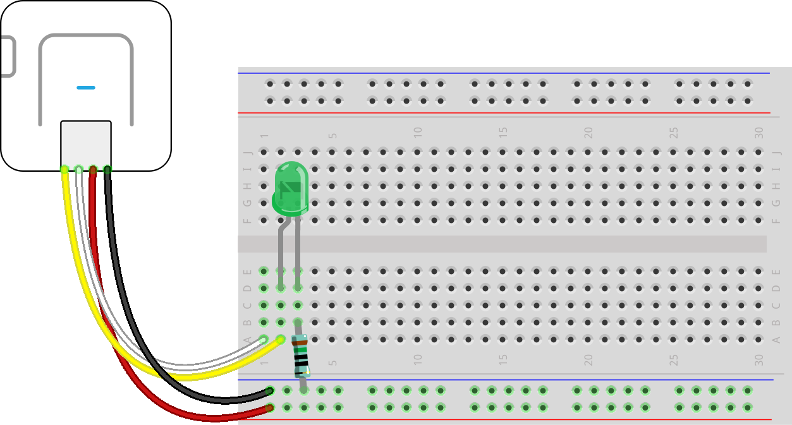

## Assignment 1
Assignment 1 description  

[Repository README link](../README.md)  
[Assignment 1 Code link](assignment01_example.py)   

Code snipped for changing states in the program:  

```Python
# conditions for changing from START to WAITING and RUN states:
  if program_state == 'START': # or program_state == 'WAITING' or program_state == 'RUN':
    #if input_pin_val == True:
    if input_pin.value() == True: # input pin is high
      set_program_state('WAITING')
    else:
      set_program_state('RUN')
```
Image link example:

