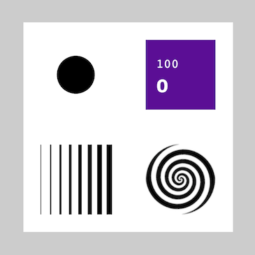

### WebSerial PyScript Template  
  
This software template shows an example of reading 2 inputs from hardware as a way to control various graphical shapes, fonts, images and sound playback with a software program.  

The software code uses the Python syntax, by combining [PyScript](https://pyscript.net/) with the [p5 Graphics Library](https://p5js.org/) and [Web Serial API](https://developer.mozilla.org/en-US/docs/Web/API/Web_Serial_API).  For a more basic example of these features, see [WebSerial Pyscript Test](../webserial_pyscript_test/).

NOTE: this template expects 2 inputs from the hardware, separated by comma.  The first input can be an analog value in the range 0 - 255.  The second one should be a digital value that is 0 or 1 (such as button input).

The software program can be previewed running and responding to the inputs online by following these steps:

1. use Thonny to run a firmware example such as [print_adc_and_button.py](../print_adc_and_button.py) or [print_imu_and_button.py](../print_imu_and_button.py) on your AtomS3 hardware.  Observe that 2 values separated by comma are printed to the terminal in Thonny.  

2. disconnect from AtomS3 (change the Python interpreter to "Local Python 3" option at the bottom right of Thonny window).  The firmware program should still be running and updating the display on AtomS3.

3. go to the [GitHub Pages link for this directory](https://pa-nik.github.io/SP24-IXD-256/class05/webserial_pyscript_template/) and click the 'Connect' button.  You should see the number values under the button updated and various graphical elements responding to the inputs.  In addition, pressing the screen button on AtomS3 should trigger sound playback.  

